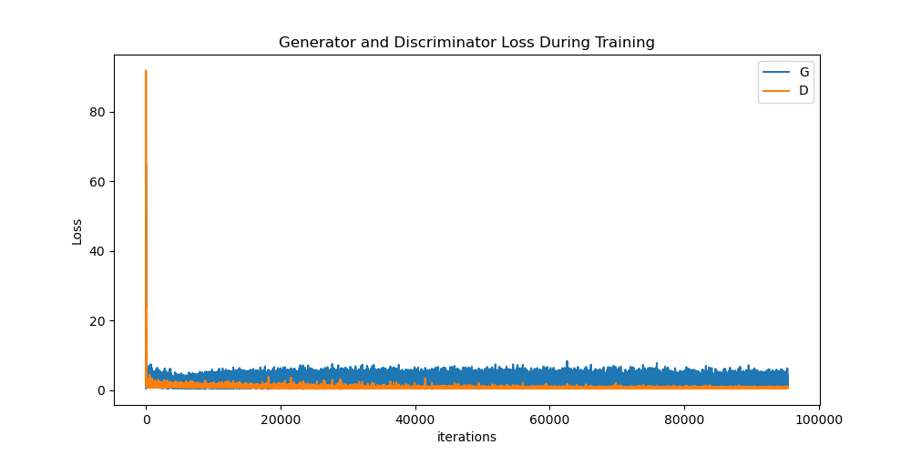

# GAN for Face Generation

This repository contains the code for training a Generative Adversarial Network (GAN) on the CelebA dataset to generate realistic human faces. The codebase was developed and utilized on an Apple M1 Mac, hence the utilization of the 32-bit floating point data type as 64-bit has not been implemented within the current PyTorch library's API.

## Dependencies

-   Python 3.x
-   PyTorch
-   torchvision
-   matplotlib
-   numpy

To install the required packages, run the following command:

```
pip install -r requirements.txt
```

## Dataset

The model is trained on the CelebA dataset, which can be downloaded automatically by the PyTorch `torchvision.datasets` module.

## Usage

1. Clone the repository:

```
git clone https://github.com/LeSnack/gan-for-face-gen.git
cd gan-for-face-gen
```

2. Train the model:

```
python gan_model_training.py
```

This will train the GAN on the CelebA dataset and save the trained models to `generator.pth` and `discriminator.pth`.

3. Generate faces:

```
python face_generation.py --num_faces 5
```

This will generate 5 faces using the trained model.

## Model Architecture

The GAN consists of a Generator and a Discriminator, both implemented as convolutional neural networks.

-   The Generator takes a random noise vector as input and generates a 64x64 RGB image.
-   The Discriminator takes a 64x64 RGB image as input and classifies it as real or fake after transforming the image to a
    1x1x1 scalar.

## Results

After training the model, you can generate realistic human faces. Here is an example of faces generated by the model after training for 40 epochs:


See below for comparisons of Generator and Discriminator loss over a 75 epoch training period:




## Acknowledgements

This code is based on the PyTorch DCGAN tutorial: [PyTorch DCGAN tutorial](https://pytorch.org/tutorials/beginner/dcgan_faces_tutorial.html)

The structure of the model was influenced by the paper: [Unsupervised Representation Learning with Deep Convolutional Generative Adversarial Networks](chrome-extension://efaidnbmnnnibpcajpcglclefindmkaj/https://arxiv.org/pdf/1511.06434.pdf)
